<!-- markdownlint-disable MD025 -->
<!-- markdownlint-disable MD033 -->

# <center> **Section 3: A first look at React**

---

# 11. **What is React?**

---

- **Based on components:** Heavily reusable areas like nav, buttons, pictures, anything we see
- **Declarative:** We describe how components look like and how they work using JSX based on current data/state. React is basically abstraction from standard DOM. JSX Handles all HTML/CSS/JS
- **State-Driven**: State (Array of apartments) > Render > UI (Components in JSX) > Update State > Repeat

---

# 13. **Pure React**

---

Scenario below is not really how React is done (I have no idea what's going on) Come back to it late

```js
<!DOCTYPE html>
<html lang="en">
  <head>
    <meta charset="UTF-8" />
    <meta name="viewport" content="width=device-width, initial-scale=1.0" />
    <title>Hello React!</title>
  </head>
  <body>
    <div id="root"></div>

    <script src="https://unpkg.com/react@18/umd/react.development.js"></script>
    <script src="https://unpkg.com/react-dom@18/umd/react-dom.development.js"></script>

    <script>
      function App() {
        //const time = new Date().toLocaleTimeString();
        const [time, setTime] = React.useState(new Date().toLocaleTimeString());

        React.useEffect(function () {
          setInterval(function () {
            setTime(new Date().toLocaleTimeString());
          });
        }, 1000);

        return React.createElement("header", null, `Hello React! It's ${time}`);
      }

      const root = ReactDOM.createRoot(document.getElementById("root"));
      root.render(React.createElement(App));
    </script>
  </body>
</html>

```

---

# 15. **Setting Up and New React Project: The options**

---

- **Create React App**
- Complete starter kit
- Everything already configured: ESLint, Prettier etc.
- However, not used at all as it's slow and outdated.

- **Vite**
- Real world apps
- Modern build tool that ocntains starter template
- Manual set up
- Extremely fast with refreshing, bundling

---

# <center> **Review of Esseitnal Javascript for React**

---

# 18. **Destructuring Objects and Arrays**

---

```js
// ---------- Simple destructuring objects
const book = getBook(1); //Choose the object

const { title, author, pages, publicationDate, genres, hasMovieAdaptation } =
  book; // On the left, we choose the objects within the object

console.log(title, author, pages, publicationDate, genres, hasMovieAdaptation);

// Simple destructuring arrays

const [primaryGenre, secondaryGenre] = genres;
console.log(primaryGenre, secondaryGenre);
```

---

# 19. **Rest/Spread Operator**

---

```js
//------- Rest Operator
const [primaryGenre, secondaryGenre, ...otherGenres] = genres; // Always at the end, choosing the rest of the arguments/data
console.log(otherGenres);

// ---- Spread operator
const newGenres = [...genres, "new added epic fantasy"]; // This simplt spreads genres, making everything equal
console.log(newGenres);

const updateBook = {
  ...book,
  // Adding new property
  moviePublicationDate: "2001-12-19",
  //Changing existing property
  pages: 1210,
};
updateBook;
```

---

# 20. **Ternary Operators**

---

```js
// ------- Ternary operator
//1. Choose the condition (if statements) 2. If true do this 3. IF false then do thiss
pages > 1000 ? "Over a thousand pages" : "Less than a thousand pages";
```

---

# 21. **Arrow Functions**

```js
const foo = (value) => value + 2;
console.log(foo(2)); // = 4
```

---

# 23. **Short-Circuiting And Logical Operators: &&, ||, ??**

---

```js
// falsy: 0, null, "",undefined

// Short circuting (if the value is true)
console.log(true && "some value");
console.log(false && "some value");
console.log(hasMovieAdaptation && "This book has a movie");

// Or (if the value is false)
console.log(true || "some string"); // true
console.log(false || "some string"); // some string

const spanishTranslation =
  book.translations.spanish || "Not translated in spanish";
console.log(spanishTranslation);

// This one throws aways any falsy value as the argument we give
console.log(book.reviews.librarything.reviewsCount);
const countWrong = book.reviews.librarything.reviewsCount || "No Data";
countWrong; // No data
// This one only accepts null or undefined
const count = book.reviews.librarything.reviewsCount ?? "No data";
```

---

# 24. **Optional Chaining**

---

```js
function getTotalReviewCount(book) {
  const goodreads = book.reviews.goodreads.reviewsCount;
  const librarything = book.reviews.librarything?.reviewsCount ?? 0; // If anything after question mark is non existent, we swap it with whats after ??
  return goodreads + librarything;
}

console.log(getTotalReviewCount(book));
```

---

# 25. **The Array map Method**

---

```js
const x = [1, 2, 3, 4, 5].map((el) => el * 2);

const titles = books.map((book) => book.title); // map is basically loop, but for objects

const essentialData = books.map((book) => ({
  // Here we can go through the whole object, and pick what we want from the ID which is specific name

  title: book.title, // Name of what we want to print > whatever we want to print
  author: book.author,
  reviewsCount: getTotalReviewCount(book),
}));
essentialData;
```

---

# 26. **The array filter Method**

```js
// First is to choose argument, then where we get it from and lastly, condition. It needs to be true
const longBooksWithMovie = books
  .filter((book) => book.pages > 500) // && can be used as well
  .filter((book) => book.hasMovieAdaptation);
// Very similar to map, but this one is quicker with if statement included

console.log(longBooksWithMovie);

const adventureBooks = books
  .filter((books) => books.genres.includes("adventure"))
  .map((book) => book.title); // chose to only show titles
console.log(adventureBooks);
```

---

# 27. **The Array reduce Method**

---

```js
// Acc is cumulator of the value
const pagesAllBooks = books.reduce((sum, book) => sum + book.pages, 0); // Reduce always gives only one value. We need accumulator, and then function
```

---

# 28. **The Array sort Method**

---

```js
// ---------- 28. The Array sort Method

// Mutated

const arr = [9, 2, 7, 4, 2];
const sorted = arr.sort((a, b) => a - b); //JS goes through the array, it calls this function, if it is "-" = Ascending
sorted;
arr; // Sort function mutated original array

// Not mutated

const arr2 = [9, 2, 7, 4, 2];
const sorted2 = arr.slice().sort((a, b) => a - b); //JS goes through the array, it calls this function, if it is -: Ascending
sorted2;
arr2; // Not mutated due to slice function that does nothing, but makes JS not mutate original array

const sortedPages = books.slice().sort((a, b) => a.pages - b.pages);
sortedPages;
```

---

# 29. **Working With Immutable Arrays**

---

```js
// 1) Add book object to array

const newBook = {
  id: 6,
  title: "Harry Potter and Wizards of Harry",
  author: "J. K. Rowling",
};
const booksAfterAdd = [...books, newBook]; // Spread operator and add extra object in the array

// 2) Delete book object from array

const booksAfterDelete = booksAfterAdd.filter((book) => book.id !== 3); // only include books whose id is not 3
booksAfterDelete;

// 3) Update book object in the array

const booksAfterUpdate = booksAfterDelete.map(
  (book) => (book.id === 1 ? { ...book, pages: 1 } : book) // Basically loops through the book, checks for book id 2, if if exists then spread this book component,
  // changes pages:1 (because it already exists). Anything other than that, keep the book as it is.
);
booksAfterUpdate;
```

---

# 30. **Asynchronous JavaScript: Promises**

---

```js
fetch("https://jsonplaceholder.typicode.com/todos/1") // 1. Make a GET request to the API endpoint
  .then((response) => response.json()) // 2. Convert the raw HTTP response into usable JSON
  .then((data) => console.log(data)); // 3. Use the parsed JSON data (here we just log it)

js;
```

# 31. **Asynchronous JavaScript: Async/Await**

---

```js
// 31. Asynchronous JavaScript: Async/Await ( Better)
async function getTodos() {
  // Makes the code asynchronous
  const res = await fetch("https://jsonplaceholder.typicode.com/todos/1"); // Fetching API
  const data = await res.json(); // Stores json in the variable
  console.log(data);
}

getTodos();
```

---

# <centre> **Section 5: Working With Components, Props, and JSX**

---

# 33. **Rendering the Root Component and Strict Mode**

---

First > Create React App

// Index.js needs to be created and is the most important file to run inside src folder. It needs to be called like this

**npx create-react-app my-app
cd my-app
npm start**

Index.js folder below needs to be like this in order for React to run

```js
import React from "react";
import ReactDOM from "react-dom/client";

function App() {
  // Always upper case
  return <h1>Hello React</h1>;
}

const root = ReactDOM.createRoot(document.getElementById("root")); // Root is in main html so this is a link
root.render(
  <React.StrictMode>
    <App />
  </React.StrictMode>
); // Run React
```

---

# 35. **Components as building blocks**

---

- They are the most fundamental parts of React.
- React applications are entirely made out of components.
- Building blocks of user interfaces in React
- Piece of UI that has its own data, logic and appearance.
- Components can be reused, nested inside each other and pass data between them

---

# 36. **Creating And Reusing a Component**

---

```js
import React from "react";
import ReactDOM from "react-dom/client";

const pizzaData = [
  {
    name: "Focaccia",
    ingredients: "Bread with italian olive oil and rosemary",
    price: 6,
    photoName: "pizzas/focaccia.jpg",
    soldOut: false,
  },
  {
    name: "Pizza Margherita",
    ingredients: "Tomato and mozarella",
    price: 10,
    photoName: "pizzas/margherita.jpg",
    soldOut: false,
  },
  {
    name: "Pizza Spinaci",
    ingredients: "Tomato, mozarella, spinach, and ricotta cheese",
    price: 12,
    photoName: "pizzas/spinaci.jpg",
    soldOut: false,
  },
  {
    name: "Pizza Funghi",
    ingredients: "Tomato, mozarella, mushrooms, and onion",
    price: 12,
    photoName: "pizzas/funghi.jpg",
    soldOut: false,
  },
  {
    name: "Pizza Salamino",
    ingredients: "Tomato, mozarella, and pepperoni",
    price: 15,
    photoName: "pizzas/salamino.jpg",
    soldOut: true,
  },
  {
    name: "Pizza Prosciutto",
    ingredients: "Tomato, mozarella, ham, aragula, and burrata cheese",
    price: 18,
    photoName: "pizzas/prosciutto.jpg",
    soldOut: false,
  },
];

function App() {
  // Always upper case
  return (
    <div>
      <h1>Hello React</h1>
      <Pizza />
      <Pizza /> {/* This is easily copied */}
    </div>
  );
}

// Components are always functions, always capital letter. Always on top, never nested (inside eachother)
function Pizza() {
  return (
    <div>
      
      <h2>Pizza Spinaci</h2>
      <p>"Tomato, mozarella, spinach, and ricotta cheese"</p>
    </div>
  );
}

const root = ReactDOM.createRoot(document.getElementById("root")); // Root is html so this is a link
root.render(
  <React.StrictMode>
    <App />
  </React.StrictMode>
); // Run React
```

---

# 37. **What is JSX?**

---

- Declarative Syntax to describe what components look like and how they work
- components must return a block of JSX
- Extension of JS that allows us to embed JavaScript, CSS and React components into HTML
- Each JSX element is converted to a React.createelement function call
- We could use React without JSC (not fun)

- **JSX is Declarative**

**Imperative> Vanilla** JS with get element ID or query selector

- Manual DOM element sections and DOM traversing
- Step by step DOM mutations until we reach the desired UI

- **Declarative**
- Describe what UI should look like using JSX, based on current data
- React is an abstraction away from DOM: we never touch the DOM

---

# 38. **Creating More Components**

---

```js
import React from "react";
import ReactDOM from "react-dom/client";

const pizzaData = [
  {
    name: "Focaccia",
    ingredients: "Bread with italian olive oil and rosemary",
    price: 6,
    photoName: "pizzas/focaccia.jpg",
    soldOut: false,
  },
  {
    name: "Pizza Margherita",
    ingredients: "Tomato and mozarella",
    price: 10,
    photoName: "pizzas/margherita.jpg",
    soldOut: false,
  },
  {
    name: "Pizza Spinaci",
    ingredients: "Tomato, mozarella, spinach, and ricotta cheese",
    price: 12,
    photoName: "pizzas/spinaci.jpg",
    soldOut: false,
  },
  {
    name: "Pizza Funghi",
    ingredients: "Tomato, mozarella, mushrooms, and onion",
    price: 12,
    photoName: "pizzas/funghi.jpg",
    soldOut: false,
  },
  {
    name: "Pizza Salamino",
    ingredients: "Tomato, mozarella, and pepperoni",
    price: 15,
    photoName: "pizzas/salamino.jpg",
    soldOut: true,
  },
  {
    name: "Pizza Prosciutto",
    ingredients: "Tomato, mozarella, ham, aragula, and burrata cheese",
    price: 18,
    photoName: "pizzas/prosciutto.jpg",
    soldOut: false,
  },
];

function App() {
  // Always upper case
  return (
    <div>
      <Header /> {/*Components*/}
      <Menu />
      <Footer />
    </div>
  );
}

function Header() {
  return <h1>Fast React Pizza Co.</h1>;
}
function Menu() {
  return (
    <div>
      <h2>Our Menu</h2>
      <Pizza />
    </div>
  );
}
function Footer() {
  return (
    <footer>{new Date().toLocaleTimeString()}. We're currently open</footer>
  );
  // return React.createElement("footer", null, "We're currently open");
}

// Components are always functions, always capital letter. Always on top, never nested (inside eachother)
function Pizza() {
  return (
    <div>
      
      <h2>Pizza Spinaci</h2>
      <p>"Tomato, mozarella, spinach, and ricotta cheese"</p>
    </div>
  );
}

const root = ReactDOM.createRoot(document.getElementById("root")); // Root is html so this is a link
root.render(
  <React.StrictMode>
    <App />
  </React.StrictMode>
); // Run React
```

---

# 39. **JavaScript Logic in Components**

---

```js
function Header() {
  const hour = new Date().getHours();
  const openHour = 12;
  const closeHour = 22;

  const isOpen = hour >= openHour && hour < closeHour; // This will set Boolean value
  console.log(isOpen);

  return <h1>Fast React Pizza Co.</h1>;
}
```

---

# 40. **Seperation of concerns**

---

- Vanilla JS > One technilogy per file (HTML,CSS,JS)
- React > One component per file (Header, Filter, Menu etc.)

---

# 41. **Styling React Applications**

---

```js
function App() {
  // Always upper case
  return (
    <div className="container">
      {/* Always use className and then refer to CSS styling*/}
      <Header /> {/*Components*/}
      <Menu />
      <Footer />
    </div>
  );
}

function Header() {
  // const style = { color: "red", fontSize: "40px", texttransform: "uppercase" }; // This one is easy but messy for later use
  const style = {};
  b;
  return (
    <header className="header">
      <h1 style={style}>Fast React Pizza Co.</h1>
    </header>
  );
}
```

---

# 42. **Passing and Receiving Props**

---

```js
function Menu() {
  return (
    <div className="menu">
      <h2>Our Menu</h2>
      <Pizza
        name="Pizza Spinaci"
        ingredients="Tomato, mozarella, spinach, and ricotta cheese"
        photoName="/pizzas/spinaci.jpg"
        price={10}
      />
      <Pizza
        name="Pizza Funghi"
        ingredients="Tomato, mushrooms"
        price={10}
        photoName="pizzas/funghi.jpg"
      />
    </div>
  );
}

function Pizza(props) {
  //props will appear because we have used it above, meaning they are connected
  console.log(props);
  return (
    <div className="pizza">
      
      <div>
        {" "}
        <h3>{props.name}</h3>
        <p>{props.ingredients}</p>
        <span>{props.price}</span>
      </div>
    </div>
  );
}
function Footer() {
  const hour = new Date().getHours();
  const openHour = 12;
  const closeHour = 22;

  const isOpen = hour >= openHour && hour < closeHour; // This will set Boolean value

  return (
    <footer className="footer">
      {isOpen === true ? "We're open" : "We're closed"}
    </footer>
  );
  // return React.createElement("footer", null, "We're currently open");
}
```

---

# 43. **Props, Immutability, and One-Way data flow**

---

- Props are used to pass data from parent componens to child components (down the component tree)
- Essential tool to configure and customize components (like function parameters)
- With props, parent components control how child components look and work
- Anything can be passed as props, single values, arrays, objects, functions and even other components.

## Props are immutable, while states are

- React uses one way data flow from Parent to child
- One way data flow is more performant, makes apps easier to debug and makes it predicatble.

---

# 44. Challenge. Profile card

DONE

---

# 45. **The Rules of JSX**

---

## **General JSX Rules**

- JSC works essentially like HTML, but we can enter "JS mode" by using {}
- We can place JS expressions inside {}. Examples: reference variables, create arrays or objects, [].map(), ternary operator
- Statements are not allowed (if/else. for, switch)
- JSX produces a JavaScript expression

---

# 46. **Rendering lists**

---

```js
// This code maps over the pizzaData array.
// For each pizza object, it renders a <Pizza /> component.
// It passes the pizza object as a prop named pizzaObj.
// A unique key (here, the pizza name) is used to help React track items in the list.
<ul className="pizzas">
  {pizzaData.map((pizza) => (
    <Pizza pizzaObj={pizza} key={pizza.name} />
  ))}
</ul>
```

```js
// This functional component receives a pizzaObj via props.
// It displays the pizza's image, name, ingredients, and price.
function Pizza(props) {
  //props will appear because we have used it above, meaning they are connected
  return (
    <li className="pizza">
      
      <div>
        {" "}
        <h3>{props.pizzaObj.name}</h3>
        <p>{props.pizzaObj.ingredients}</p>
        <span>{props.pizzaObj.price}</span>
      </div>
    </li>
  );
}
```

---

# 47. **Conditional Rendering With &&**

```js
function Menu() {
  const pizzas = pizzaData;
  const numPizzas = pizzas.length;
  return (
    <main className="menu">
      <h2>Our Menu</h2>
      {numPizzas > 0 ? (
        <ul className="pizzas">
          {pizzas.map((pizza) => (
            <Pizza pizzaObj={pizza} key={pizza.name} />
          ))}
        </ul>
      ) : (
        <p>We are working on our menu</p>
      )}
    </main>
  );
}
```

---

# 51. **Destructuring Objects**

```js
function Footer() {
  const hour = new Date().getHours();
  const openHour = 12;
  const closeHour = 23;

  const isOpen = hour >= openHour && hour < closeHour; // This will set Boolean value

  // Conditional Rendering with Multiple returns

  return (
    <footer className="footer">
      {isOpen === true ? (
        <Order closeHour={closeHour} openHour={openHour} />
      ) : (
        `We're currently closed, we will open at ${openHour}`
      )}
    </footer>
  );
  // return React.createElement("footer", null, "We're currently open");
}

function Order({ closeHour, openHour }) {
  // this is new props method that takes info from the above,
  // Props are read-only: Order uses them but does not modify them.
  // Props can be any data type: Here, both closeHour and openHour are numbers.
  // Parent → Child direction: Props flow one way — Footer (parent) gives data to Order (child).
  // Destructuring makes code cleaner: Instead of props.openHour, you just use openHour.
  return (
    <div className="order">
      <p>
        We're open from {openHour} until {closeHour}:00. Come visit us or order
        online
      </p>
      <button className="btn">order</button>
    </div>
  );
}
```

---

# 52. **React Fragment**

```js
function Menu() {
  const pizzas = pizzaData;
  const numPizzas = pizzas.length;
  return (
    <main className="menu">
      <h2>Our Menu</h2>

      {numPizzas > 0 ? (
        <>
          {/*          Instead of putting it in the div, use empty curling braces to do
          fragment and group things together as JSX only allows one element
          Basically, we have <p> and <ul> in the same format */}
          <p>Authentic Italian Cousine</p>
          <ul className="pizzas">
            {pizzas.map((pizza) => (
              <Pizza pizzaObj={pizza} key={pizza.name} />
            ))}
          </ul>
        </>
      ) : (
        <p>We are working on our menu</p>
      )}
    </main>
  );
}
```

---

# 53. **Setting Classes and Text Conditionally**

---

```js
function Pizza({ pizzaObj }) {
  //props will appear because we have used it above, meaning they are connected
  return (
    // This here is very similar, ternary operator for css styling
    <li className={`pizza ${pizzaObj.soldOut ? "sold-out" : ""}`}>
      
      <div>
        {" "}
        <h3>{pizzaObj.name}</h3>
        <p>{pizzaObj.ingredients}</p>
        <span>{pizzaObj.soldOut ? "Sold Out" : pizzaObj.price}</span> {/*  Setting text conditionally */}
      </div>
    </li>
  );
}
```

---

# 55. **Challenge 2**

```js
import React from "react";
import ReactDOM from "react-dom/client";
import "./index.css";

const skills = [
  { name: "JavaScript", level: "advanced", color: "bisque" },
  { name: "HTML", level: "intermediate", color: "beige" },
  { name: "CSS", level: "advanced", color: "yellow" },
  { name: "React", level: "intermediate", color: "red" },
  { name: "BackEnd", level: "beginner", color: "white" },
  { name: "FrontEnd", level: "intermediate", color: "brown" },
  { name: "Quantum physics", level: "beginner", color: "green" },
];

const root = ReactDOM.createRoot(document.getElementById("root"));
root.render(
  <React.StrictMode>
    <App />
  </React.StrictMode>
);

function App() {
  return <MainBox />;
}
function MainBox() {
  return (
    <div className="mainBox">
      <div className="pictureBox">
        </img>
      </div>
      <h1 className="title">Radoslaw Balicki</h1>
      <p className="description">
        Lorem ipsum dolor sit amet, consectetur adipiscing elit, sed do eiusmod
        tempor incididunt ut labore et dolore magna aliqua. Ut enim ad minim
        veniam, quis nostrud exercitation ullamco laboris nisi ut aliquip ex ea
        commodo consequat.
      </p>
      <SkillSet />
    </div>
  );
}
function SkillSet() {
  return (
    <div className="skillset">
      {skills.map((data) => (
        <Skill
          name={data.name}
          level={data.level}
          color={data.color}
          key={data.name}
        />
      ))}
    </div>
  );
}

function Skill({ name, level, color }) {
  return (
    <div className="skill" style={{ backgroundColor: color }}>
      <p>{name}</p>
      <p>
        {level === "beginner" && "😐"}
        {level === "intermediate" && "😌"}
        {level === "advanced" && "😁"}
      </p>
    </div>
  );
}
```

---

# <centre> Section 6: **State, Events, and Forms: Interactive Components**

---

```js
const messages = [
  "Learn React ⚛️",
  "Apply for jobs 💼",
  "Invest your new income 🤑",
];

export default function App() {
  const step = 2;
  return (
    <div className="steps">
      <div className="numbers">
        <div className={step >= 1 && "active"}>1</div>
        <div className={step >= 2 && "active"}>2</div>
        <div className={step >= 3 && "active"}>3</div>
      </div>

      <p className="message">
        Step {step}: {messages[step - 1]}
      </p>

      <div className="buttons">
        <button style={{ backgroundColor: "#7950f2", color: "fff" }}>
          Previous
        </button>
        <button style={{ backgroundColor: "#7950f2", color: "fff" }}>
          Next
        </button>
      </div>
    </div>
  );
}
```

---

# 59. **What is state in React?**

---

- state is a data that component can hold over time, necessary for information that it needs to remember throughout the app's lifecycle.
- Component's memory!
- State variable/piece of state: A single variable in a component (component state)
- Updating component state triggers React to re-render the component

---

# 60. **Creating a State Variable With useState**

---

```js
import { useState } from "react";

const messages = [
  "Learn React ⚛️",
  "Apply for jobs 💼",
  "Invest your new income 🤑",
];

export default function App() {
  const [step, setStep] = useState(1);

  function handlePrevious() {
    if (step > 1) setStep(step - 1);
  }
  function handleNext() {
    if (step < 3) setStep(step + 1);
  }
  return (
    <div className="steps">
      <div className="numbers">
        <div className={step >= 1 ? "active" : ""}>1</div>
        <div className={step >= 2 ? "active" : ""}>2</div>
        <div className={step >= 3 ? "active" : ""}>3</div>
      </div>

      <p className="message">
        Step {step}: {messages[step - 1]}
      </p>

      <div className="buttons">
        <button
          style={{ backgroundColor: "#7950f2", color: "fff" }}
          onClick={handlePrevious}
          // onMouseEnter={() => console.log("Enter")}
        >
          Previous
        </button>
        <button
          style={{ backgroundColor: "#7950f2", color: "fff" }}
          onClick={handleNext}
        >
          Next
        </button>
      </div>
    </div>
  );
}
```

---

# 62. **The Mechanics of state**

---

- Because React is declarative, We don't do direct DOM manipulations
- In React, a view is updated by re-rendering the component
- A component is re-rendered when its state is updated

---

# 68. **Second Challenge**

---

```js
import React, { useState } from "react";

export default function App() {
  const [step, setStep] = useState(1);
  const [count, setCount] = useState(0);
  const [countShow, setCountShow] = useState(0); // this is only for UI

  const date = new Date();
  const numericalDate = date.getTime();
  const day = 1000 * 60 * 60 * 24 * count; // Day in numerical value

  const dateOptions = {
    weekday: "long",
    year: "numeric",
    month: "long",
    day: "numeric",
  };

  const countDay = new Date(numericalDate + day);

  function handleNextStep() {
    setStep((s) => s + 1);
  }

  function handlePreviousStep() {
    setStep((s) => s - 1);
  }

  function handleNextCount() {
    setCount((s) => s + step);
    setCountShow((s) => s + 1);
  }

  function handlePreviousCount() {
    setCount((s) => s - step);
    setCountShow((s) => s - 1);
  }

  return (
    <div className="app">
      <div className="settings">
        <button className="button" onClick={() => handlePreviousStep()}>
          -
        </button>
        <p className="stepCounter">Step: {step}</p>
        <button className="button" onClick={() => handleNextStep()}>
          +
        </button>
      </div>
      <div>
        <div className="settings">
          <button className="button" onClick={() => handlePreviousCount()}>
            -
          </button>
          <p className="stepCounter">Count: {countShow}</p>
          <button className="button" onClick={() => handleNextCount()}>
            +
          </button>
        </div>
      </div>
      <div className="timer">
        {countDay.getTime() === date.getTime() ? (
          <p>Today is {countDay.toLocaleDateString("en-UK", dateOptions)}</p>
        ) : (
          <p>
            {` ${count} days from today is
            ${countDay.toLocaleDateString("en-UK", dateOptions)}`}
          </p>
        )}
      </div>
    </div>
  );
}
```

---

# 70. **Building a layout**

---

```js
import React from "react";

export default function App() {
  return (
    <div className="app">
      <Logo />
      <Form />
      <PackingList />
      <Stats />
    </div>
  );
}

function Logo() {
  return <h1>🌴Far away👜</h1>;
}
function Form() {
  return (
    <div className="add-form">
      <h3>Wha do you need for your trip? 😊</h3>
    </div>
  );
}
function PackingList() {
  return <div className="list">LIST</div>;
}
function Stats() {
  return (
    <footer className="stats">
      <em> You have X items on your list, and you already packed X(%) </em>
    </footer>
  );
}
```

---

# 71. **Rendering the Items List**

---

```js
import React from "react";

export default function App() {
  return (
    <div className="app">
      <Logo />
      <Form />
      <PackingList />
      <Stats />
    </div>
  );
}

function Logo() {
  return <h1>🌴Far away👜</h1>;
}
function Form() {
  return (
    <div className="add-form">
      <h3>Wha do you need for your trip? 😊</h3>
    </div>
  );
}
function PackingList() {
  return <div className="list">LIST</div>;
}
function Stats() {
  return (
    <footer className="stats">
      <em> You have X items on your list, and you already packed X(%) </em>
    </footer>
  );
}
```

---

# 72. **Building a Form and Handling Submissions**

---

```js
function Form() {
  function handleSubmit(e) {
    e.preventDefault();
  }
  return (
    <form className="add-form" onSubmit={handleSubmit}>
      {" This will work because we can press Enter and it will work as well "}

      <h3>What do you need for your trip? 😊</h3>
      <select>
        {Array.from({ length: 20 }, (_, i) => i + 1).map((num) => (
          <option value={num} key={num}>
            {num}
          </option>
        ))}
      </select>
      <input type="text" placeholder="Item..."></input>
      <button>Add</button>
    </form>
  );
}
```

---

# 73. **Controlled Elements**

---

```js
import React, { use, useState } from "react";

const initialItems = [
  { id: 1, description: "Passports", quantity: 2, packed: false },
  { id: 2, description: "Socks", quantity: 12, packed: false },
  { id: 3, description: "Charger", quantity: 1, packed: false },
];

export default function App() {
  return (
    <div className="app">
      <Logo />
      <Form />
      <PackingList />
      <Stats />
    </div>
  );
}

function Logo() {
  return <h1>🌴Far away👜</h1>;
}
function Form() {
  const [description, setDescription] = useState("");
  const [quantity, setQuantity] = useState(1);

  function handleSubmit(e) {
    e.preventDefault(); // Prevents reload of the page
    if (!description) return; // If it is empty the do nothing
    const newItem = { description, quantity, packed: false, id: Date.now() }; // Create new Item based on the states
    console.log(newItem);

    setDescription(""); // Sets back to original state
    setQuantity(1); // Same
  }

  return (
    <form className="add-form" onSubmit={handleSubmit}>
      <h3>What do you need for your trip? 😊</h3>
      <select
        value={quantity}
        onChange={(e) => setQuantity(Number(e.target.value))}
      >
        {Array.from({ length: 20 }, (_, i) => i + 1).map((num) => (
          <option value={num} key={num}>
            {num}
          </option>
        ))}
      </select>
      <input
        type="text"
        placeholder="Item..."
        value={description}
        onChange={(e) => setDescription(e.target.value)} // Using state to set something new
        // e.target.value is basically any value that we have inside, very important to remember as we can pass it on further
      ></input>
      <button>Add</button>
    </form>
  );
}
function PackingList() {
  return (
    <div className="list">
      <ul>
        {initialItems.map((item) => {
          return <Item item={item} key={item.id} />;
        })}
      </ul>
    </div>
  );
}

function Item({ item }) {
  return (
    <li>
      <span style={item.packed ? { textDecoration: "line-through" } : {}}>
        {item.quantity} {item.description}
      </span>
      <button>❌</button>
    </li>
  );
}

function Stats() {
  return (
    <footer className="stats">
      <em> You have X items on your list, and you already packed X(%) </em>
    </footer>
  );
}
```

---

# 74. **States vs Props**

---

| **State**                                    | **Props**                                                                 |
| -------------------------------------------- | ------------------------------------------------------------------------- |
| Internal data, owned by component            | External data, owned by parent component                                  |
| Component memory                             | Similar to function parameters                                            |
| Can be updated by the component itself       | Read only                                                                 |
| Updating state causes component to re-render | Receiving new props causes re-render. Usually when parent's state updates |
| Used to make components interactive          |                                                                           |

**State State is like the component's personal memory — used for dynamic behavior. A component controls and updates its own state using useState or setState. When changed, it causes that component to re-render.**

**Props Props are like inputs from the parent. They are passed down and cannot be changed by the receiving (child) component. If the parent updates its state and passes down new props, the child re-renders accordingly.**

- State = local, mutable, controls interactivity.
- Props = external, read-only, passed from parent.
- They work together: Parent manages state ➝ passes via props ➝ child uses props to display or trigger changes (often calling parent functions

---

# 76. **Flashcards exercise**

---

```js
import { useState } from "react";
import "./index.css";

export default function App() {
  return (
    <div className="App">
      <FlashCards />
    </div>
  );
}

const questions = [
  {
    id: 3457,
    question: "What language is React based on?",
    answer: "JavaScript",
  },
  {
    id: 7336,
    question: "What are the building blocks of React apps?",
    answer: "Components",
  },
  {
    id: 8832,
    question: "What's the name of the syntax we use to describe a UI in React?",
    answer: "JSX",
  },
  {
    id: 1297,
    question: "How to pass data from parent to child components?",
    answer: "Props",
  },
  {
    id: 9103,
    question: "How to give components memory?",
    answer: "useState hook",
  },
  {
    id: 2002,
    question:
      "What do we call an input element that is completely synchronised with state?",
    answer: "Controlled element",
  },
];

function FlashCards() {
  // This line sets up state to keep track of the currently selected flashcard's ID
  // At first, no card is selected, so it's initialized to null
  const [selectedId, setSelectedId] = useState(null);

  function handleClick(id) {
    // If the clicked card's ID is not the current selected one,
    // update selectedId to that ID (show the answer)
    // If it is already selected, set it to null (hide the answer)
    setSelectedId(id !== selectedId ? id : null);
  }

  return (
    <div className="flashcards">
      {questions.map((q) => (
        <div
          key={q.id}
          onClick={() => handleClick(q.id)}
          // Add a CSS class if this card is currently selected
          className={q.id === selectedId ? "selected" : ""}
        >
          <p>
            {/* Show the answer if this card is selected, otherwise show the question */}
            {q.id === selectedId ? q.answer : q.question}
          </p>
        </div>
      ))}
    </div>
  );
}
```

---

# Second Timer Challenge

---

```js
import React, { useState } from "react";

export default function App() {
  const [step, setStep] = useState(1);
  const [count, setCount] = useState(0);
  const [countShow, setCountShow] = useState(0); // this is only for UI

  const date = new Date();
  const numericalDate = date.getTime();
  const day = 1000 * 60 * 60 * 24 * count; // Day in numerical value

  const dateOptions = {
    weekday: "long",
    year: "numeric",
    month: "long",
    day: "numeric",
  };

  const countDay = new Date(numericalDate + day);

  function handleNextCount() {
    setCount((s) => s + step);
    setCountShow((s) => s + 1);
  }

  function handlePreviousCount() {
    setCount((s) => s - step);
    setCountShow((s) => s - 1);
  }
  function resetTimer() {
    setCount(() => 0);
    setCountShow(() => 0);
    setStep(() => 1);
  }
  return (
    <div className="app">
      <div className="settings">
        <input
          className="slider"
          type="range"
          min="1"
          max="100"
          value={step}
          onChange={(e) => setStep(Number(e.target.value))} // this allows to change slider
        ></input>
        {/*Now get this swapped with input box*/}
        <p className="stepCounter">{step}</p>
      </div>
      <div>
        <div className="settings">
          <button className="button" onClick={() => handlePreviousCount()}>
            -
          </button>
          <input
            type="number"
            value={count}
            onChange={(e) => setCount(Number(e.target.value))} // Using state to set something new
            // e.target.value is basically any value that we have inside, very important to remember as we can pass it on further
          ></input>
          <button className="button" onClick={() => handleNextCount()}>
            +
          </button>
        </div>
      </div>
      <div className="timer">
        {countDay.getTime() === date.getTime() ? (
          <p>Today is {countDay.toLocaleDateString("en-UK", dateOptions)}</p>
        ) : (
          <p>
            {` ${count} days from today is
            ${countDay.toLocaleDateString("en-UK", dateOptions)}`}
          </p>
        )}
      </div>
      {count >= 1 || step > 1 ? (
        <button className="resetButton" onClick={() => resetTimer()}>
          Reset
        </button>
      ) : null}
    </div>
  );
}
```

---

# <centre> **Section 7: Thinking in React: State Management**

---

# 78. **What is "Thinking in React?**

---

- React Mindset > state,data flow, effects, etc.
- Thinking in state transitions, not element mutations.

### Break the desired UI into components and extablish the components tree

### Build a static version in React (without state)

### Think about state:

- When to use state
- Types to place each piece of state

### Extablish data flow

- One-way data flow
- Child to parent communication
- Accessing global state

- Thinking in React

---

# 79. **Fundamentals of state Management**

---

| **Local State**                                                                                                            | **Global State**                                                             |
| -------------------------------------------------------------------------------------------------------------------------- | ---------------------------------------------------------------------------- |
| State needed only by one or few components                                                                                 | State that many components might need                                        |
| State that is defined in a component and only that component and child components have access to it (by passing via props) | Shared state that is accessible to every component in the entire application |

---

# 80. **Thinking About State and Lifting State Up**

---

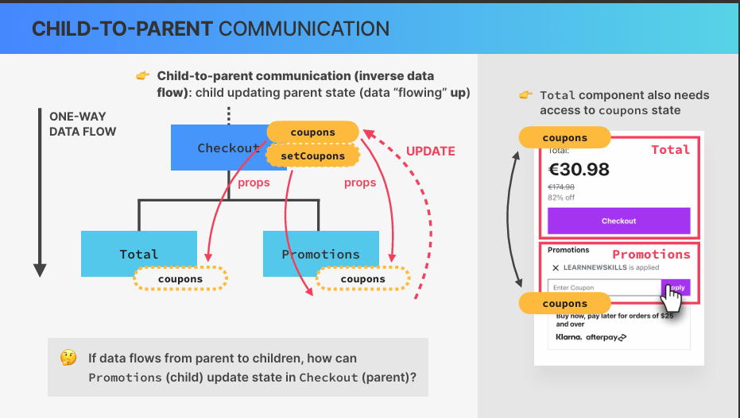

---

# 84. **Derived State**

---

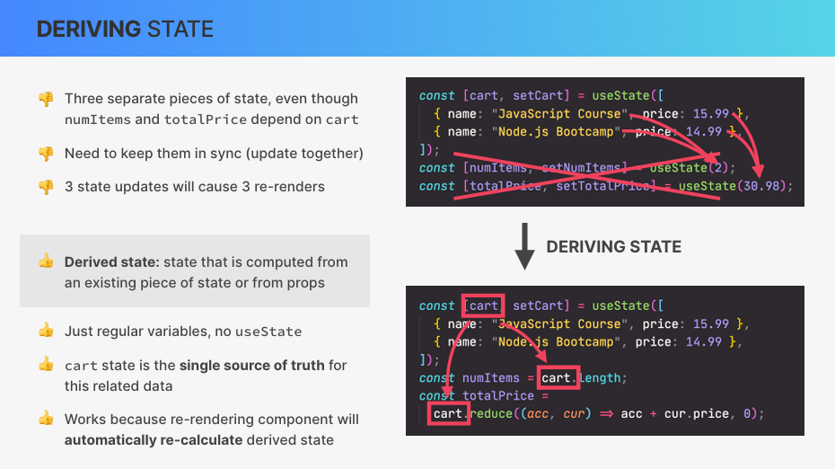

## 🧠 React: Deriving State – Crucial Notes

### ❌ Problem: Redundant State

```js
const [cart, setCart] = useState([...]);
const [numItems, setNumItems] = useState(2);
const [totalPrice, setTotalPrice] = useState(30.98);
```

**numItems and totalPrice are derived from cart, but stored separately.**

Leads to:

- Manual sync maintenance
- Multiple re-renders
- Higher bug risk

✅ Solution: Derive State from Source

```js
const [cart, setCart] = useState([...]);

const numItems = cart.length;
const totalPrice = cart.reduce((acc, cur) => acc + cur.price, 0);
```

cart is the single source of truth

Derived values are just variables, not state

💡 Key Principles

### Only use useState when:

- Value changes independently
- It's user-controlled

### Derive everything else from existing state or props

✅ Benefits

- Fewer re-renders
- Simpler code
- Less chance of bugs
- Values always in sync

---

# 85. **Calculating Statistics as Derived State**

---

```js
function Stats({ items }) {
  const numItems = items.length;
  const numPackedItems = items.filter((item) => item.packed).length;
  const percentagePacked = Math.round((numPackedItems / numItems) * 100);
  const renderItems = function () {
    if (numItems === 0) {
      return <em>You have no items on your list</em>;
    } else if (numItems === 1 && numPackedItems === 0) {
      return (
        <em>
          You have {numItems} item on your list, and you already packed{" "}
          {numPackedItems} ({percentagePacked}%)
        </em>
      );
    } else if (numItems === numPackedItems) {
      return <em>All packed and ready to go! ✈️</em>;
    } else {
      return (
        <em>
          You have {numItems} items on your list, and you already packed{" "}
          {numPackedItems} ({percentagePacked}%)
        </em>
      );
    }
  };

  return <footer className="stats">{renderItems()}</footer>;
}
```

---

# 86. **Sorting Items**

---

```js
let sortedItems;

if (sortBy === "input") sortedItems = items; // If the user chooses to sort by "input", return the original array — no sorting.
if (sortBy === "description")
  sortedItems = items
    .slice()
    .sort((a, b) => a.description.localeCompare(b.description)); // Slice not to mutate, localeCompare() is a string-safe alphabetical comparator (handles casing and locale).
if (sortBy === "packed")
  sortedItems = items
    .slice()
    .sort((a, b) => Number(a.packed) - Number(b.packed)); // a.packed is a boolean, so Number(a.packed) converts it to: false → 0 > true → 1
// //So this sorts: Unpacked items (0) first > Packed items (1) last

<div className="actions" onChange={(e) => setSortBy(e.target.value)}>
  <select value={sortBy}>
    <option value="input">Sort by input order</option>
    <option value="description">Sort by description</option>
    <option value="packed">Sort by packed status</option>
  </select>
</div>;
```

---

# 87. **Clearing the list**

---

```js
function handleDeleteAllItems(id) {
  const confirmed = window.confirm(
    "Are you sure you want to delete all items?"
  );

  if (confirmed) setItems([]);
}
```

---

# 88. **Moving Components Into Seperate Files**

---

- When exporting component > right click on it and Refactor to a new file

- When exporting, make sure to export default and remove extra curly braces in the other components when importing

---

# 89. **Exercise #1: Accordion Component (v1)**

---

```js
import React, { useState } from "react";

const faqs = [
  {
    title: "Where are these chairs assembled?",
    text: "Lorem ipsum dolor sit amet consectetur, adipisicing elit. Accusantium, quaerat temporibus quas dolore provident nisi ut aliquid ratione beatae sequi aspernatur veniam repellendus.",
  },
  {
    title: "How long do I have to return my chair?",
    text: "Pariatur recusandae dignissimos fuga voluptas unde optio nesciunt commodi beatae, explicabo natus.",
  },
  {
    title: "Do you ship to countries outside the EU?",
    text: "Excepturi velit laborum, perspiciatis nemo perferendis reiciendis aliquam possimus dolor sed! Dolore laborum ducimus veritatis facere molestias!",
  },
];

export default function App() {
  return <Accordion data={faqs} />; // Make data as a prop to the above FAQS array
}

function Accordion({ data }) {
  return (
    <div className="accordion">
      {data.map((el, i) => (
        <AccordionItem title={el.title} text={el.text} num={i} key={el.title} /> // scanning each item and mapping them
      ))}
    </div>
  );
}

function AccordionItem({ num, title, text }) {
  // Passing props
  const [isOpen, setisOpen] = useState(); // State

  function handleToggle() {
    setisOpen((isOpen) => !isOpen); // Toggling between true and false
  }
  return (
    <div className={`item ${isOpen ? "open " : null}`} onClick={handleToggle}>
      <p className="number">{num < 9 ? `0${num + 1}` : num + 1}</p>
      <p className="text">{title}</p>
      <p className="icon">{isOpen ? "-" : "+"}</p>
      {isOpen && <p className="content-box">{text}</p>}
    </div>
  );
}
```

---

# 90. **The "children Prop: Making a Reusable Button**

---

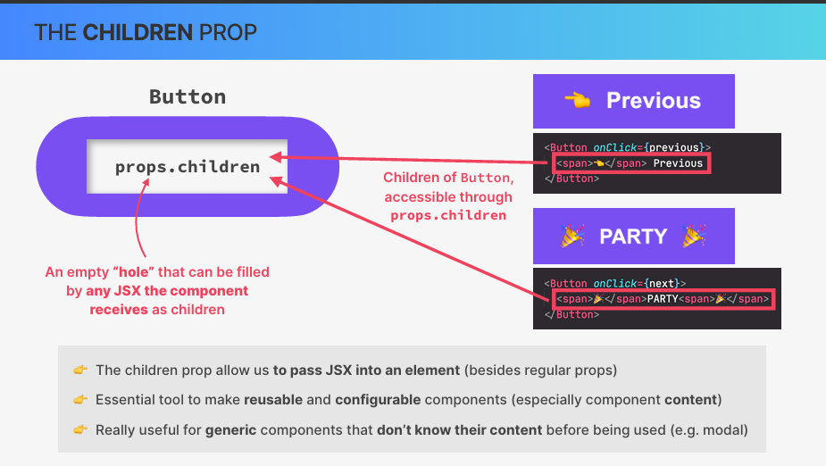

```js
import { useState } from "react";

const messages = [
  "Learn React ⚛️",
  "Apply for jobs 💼",
  "Invest your new income 🤑",
];

export default function App() {
  // const [stateVariable, setStateVariable] = useState(initialValue);

  const [step, setStep] = useState(1); // 'step' holds the current step number; 'setStep' updates it
  const [isOpen, setIsOpen] = useState(true);

  function handlePrevious() {
    if (step > 1) setStep((s) => s - 1);
  }
  function handleNext() {
    if (step < 3) setStep((s) => s + 1);
  }
  return (
    // Fragmentation
    <>
      <button className="close" onClick={() => setIsOpen((is) => !is)}>
        &times;
      </button>
      {isOpen && (
        <div className="steps">
          <div className="numbers">
            <div className={step >= 1 ? "active" : ""}>1</div>
            <div className={step >= 2 ? "active" : ""}>2</div>
            <div className={step >= 3 ? "active" : ""}>3</div>
          </div>

          <p className="message">
            Step {step}: {messages[step - 1]}
          </p>

          <div className="buttons">
            <Button bgColor="#7950f2" textColor="fff" onClick={handlePrevious}>
              <span>⏮️</span> Previous
            </Button>

            <Button bgColor="#7950f2" textColor="fff" onClick={handleNext}>
              <span>Next</span>⏭️{" "}
              {/* 
  Anything written between a component’s opening and closing tags
  becomes `props.children`. It's a built-in React prop.
  This lets us inject custom JSX content into reusable components.
*/}
            </Button>
          </div>
        </div>
      )}
    </>
  );
}

function Button({ textColor, bgColor, onClick, children }) {
  return (
    <button
      style={{ backgroundColor: bgColor, color: textColor }}
      onClick={onClick}
    >
      {children}{" "}
      {/* " Children is predefined for React so it has to be named this" */}
    </button>
  );
}
```

---

# 92. **Exercise 2: Accordion Component (v2)**

---

```js
import React, { useState } from "react";

const faqs = [
  {
    title: "Where are these chairs assembled?",
    text: "Lorem ipsum dolor sit amet consectetur, adipisicing elit. Accusantium, quaerat temporibus quas dolore provident nisi ut aliquid ratione beatae sequi aspernatur veniam repellendus.",
  },
  {
    title: "How long do I have to return my chair?",
    text: "Pariatur recusandae dignissimos fuga voluptas unde optio nesciunt commodi beatae, explicabo natus.",
  },
  {
    title: "Do you ship to countries outside the EU?",
    text: "Excepturi velit laborum, perspiciatis nemo perferendis reiciendis aliquam possimus dolor sed! Dolore laborum ducimus veritatis facere molestias!",
  },
];

export default function App() {
  return <Accordion data={faqs} />; // Make data as a prop to the above FAQS array
}

function Accordion({ data }) {
  const [curOpen, setCurOpen] = useState(null); // State
  return (
    <div className="accordion">
      {data.map((el, i) => (
        <AccordionItem
          curOpen={curOpen}
          onOpen={setCurOpen}
          title={el.title}
          num={i}
          key={el.title}
        >
          {el.text}
        </AccordionItem> // scanning each item and mapping them
      ))}
    </div>
  );
}

function AccordionItem({ num, title, curOpen, onOpen, children }) {
  // Passing props

  const isOpen = num === curOpen;

  function handleToggle() {
    onOpen(isOpen ? null : num);
  }
  return (
    <div className={`item ${isOpen ? "open " : null}`} onClick={handleToggle}>
      <p className="number">{num < 9 ? `0${num + 1}` : num + 1}</p>
      <p className="text">{title}</p>
      <p className="icon">{isOpen ? "-" : "+"}</p>
      {isOpen && <p className="content-box">{children}</p>}
    </div>
  );
}
```

---

# 93. **Challenge- Tip Calculator**

---

```js
import { useState } from "react";

const serviceData = [
  {
    id: 1,
    text: "Dissatisfied (0%)",
    value: 0,
  },
  {
    id: 2,
    text: "It was okay (5%)",
    value: 0.05,
  },
  {
    id: 3,
    text: "It was good (10%)",
    value: 0.1,
  },
  {
    id: 4,
    text: "Absolutely Amazing! (20%)",
    value: 0.2,
  },
];

export default function App() {
  const [bill, setBill] = useState(0);
  const [service, setService] = useState(0);
  const [friendRating, setFriendRating] = useState(0);

  function resetAll() {
    setBill(0);
    setService(0);
    setFriendRating(0);
  }

  return (
    <div>
      <Bill bill={bill} setBill={setBill} />
      <ServiceRating
        serviceData={serviceData}
        service={service}
        setService={setService}
      />
      <FriendRecommendation
        serviceData={serviceData}
        friendRating={friendRating}
        setFriendRating={setFriendRating}
      />
      <TotalBill
        bill={bill}
        setBill={setBill}
        serviceData={serviceData}
        service={service}
        friendRating={friendRating}
        setFriendRating={setFriendRating}
        resetAll={resetAll}
      />
    </div>
  );
}
function DropDown({ value, setValue }) {
  return (
    <select onChange={(e) => setValue(Number(e.target.value))} value={value}>
      {serviceData.map((i) => (
        <option key={i.id} value={i.value}>
          {i.text}
        </option>
      ))}
    </select>
  );
}

function Bill({ bill, setBill }) {
  return (
    <div>
      <p className="text">
        How much was the bill?
        <input
          type="number"
          placeholder=""
          value={bill}
          onChange={(e) => setBill(e.target.value)}
        ></input>
      </p>
    </div>
  );
}

function ServiceRating({ service, setService }) {
  return (
    <div>
      <p className="text">
        How much did you like the service?
        <DropDown value={service} setValue={setService} />
      </p>
    </div>
  );
}

function FriendRecommendation({ friendRating, setFriendRating }) {
  return (
    <div>
      <p className="text">
        How much did your friend like the service?
        <DropDown value={friendRating} setValue={setFriendRating} />
      </p>
    </div>
  );
}
function TotalBill({ bill, service, friendRating, resetAll }) {
  const numericBill = Number(bill);
  const finalService = numericBill * service;
  const finalFriendRating = numericBill * friendRating;

  return (
    <div>
      <p className="textBill">
        You Pay - £{numericBill === "" ? "0" : numericBill} (£
        {numericBill === "" ? "0" : numericBill} +{(
          finalService + finalFriendRating
        ).toFixed(2)} tip)
      </p>
      <button onClick={resetAll}>Reset</button>
    </div>
  );
}
```

---

# <centre> **Section 8. Practice Project: Eat-N-Split**

---

```js
import { use, useState } from "react";

const initialFriends = [
  {
    id: 118836,
    name: "Clark",
    image: "https://i.pravatar.cc/48?u=118836",
    balance: -7,
  },
  {
    id: 933372,
    name: "Sarah",
    image: "https://i.pravatar.cc/48?u=933372",
    balance: 20,
  },
  {
    id: 499476,
    name: "Anthony",
    image: "https://i.pravatar.cc/48?u=499476",
    balance: 0,
  },
];

function Button({ children, onClick }) {
  return (
    <button className="button" onClick={onClick}>
      {children}
    </button>
  );
}

export default function App() {
  const [friends, setFriends] = useState(initialFriends);
  const [showAddFriend, setShowAddFriend] = useState(false);
  const [selectedFriend, setSelectedFriend] = useState(null);

  function handleShowAddFriend() {
    setShowAddFriend((show) => !show);
  }
  function handleAddFriend(friend) {
    setFriends((friends) => [...friends, friend]);
    setShowAddFriend(false);
  }

  function handleSelection(friend) {
    setSelectedFriend((cur) => (cur?.id === friend.id ? null : friend));

    setShowAddFriend(false);
  }
  function handleSplitBill(value) {
    setFriends((friends) =>
      friends.map((friend) =>
        friend.id === selectedFriend.id
          ? { ...friend, balance: friend.balance + value }
          : friend
      )
    );
    setSelectedFriend(null);
  }

  return (
    <div className="app">
      <div className="sidebar">
        <FriendsList
          friends={friends}
          selectedFriend={selectedFriend}
          onSelection={handleSelection}
        />

        {showAddFriend && <FormAddFriend onAddFriend={handleAddFriend} />}
        <Button onClick={handleShowAddFriend}>
          {showAddFriend ? "Close" : "Add friend"}
        </Button>
      </div>
      {selectedFriend && (
        <FormSplitBill
          selectedFriend={selectedFriend}
          onSplitBill={handleSplitBill}
        />
      )}
    </div>
  );
}

function FriendsList({ friends, onSelection, selectedFriend }) {
  return (
    <div>
      <ul>
        {friends.map((friend) => (
          <Friend
            friend={friend}
            key={friend.id}
            selectedFriend={selectedFriend}
            onSelection={onSelection}
          />
        ))}
      </ul>
    </div>
  );
}

function Friend({ friend, onSelection, selectedFriend }) {
  const isSelected = selectedFriend?.id === friend.id;
  return (
    <li className={isSelected ? "selected" : ""}>
      </img>
      <h3>{friend.name}</h3>
      {friend.balance < 0 && (
        <p className="red">
          You owe {friend.name} £{Math.abs(friend.balance)}
        </p>
      )}
      {friend.balance > 0 && (
        <p className="green">
          {friend.name} owes you £{Math.abs(friend.balance)}
        </p>
      )}
      {friend.balance === 0 && <p>You and {friend.name} are even</p>}
      <Button onClick={() => onSelection(friend)}>
        {isSelected ? "Close" : "Select"}
      </Button>
    </li>
  );
}

function FormAddFriend({ onAddFriend }) {
  const [name, setName] = useState("");
  const [image, setImage] = useState("https://i.pravatar.cc/48?");

  function handleSubmit(e) {
    e.preventDefault();
    if (!name || !image) return;
    const id = crypto.randomUUID();
    const newFriend = {
      id,
      name,
      image: `${image}?=${id}`,
      balance: 0,
    };
    onAddFriend(newFriend);

    setName("");
    setImage("https://i.pravatar.cc/48?");
  }
  return (
    <form className="form-add-friend" onSubmit={handleSubmit}>
      <label>Friend Name</label>
      <input
        type="text"
        value={name}
        onChange={(e) => setName(e.target.value)}
      />
      <label>Image URL</label>
      <input
        type="text"
        value={image}
        onChange={(e) => setImage(e.target.value)}
      />
      <Button>Add</Button>
    </form>
  );
}

function FormSplitBill({ selectedFriend, onSplitBill }) {
  const [bill, setbill] = useState("");
  const [paidByUser, setPaidByUser] = useState("");
  const paidByFriend = bill ? bill - paidByUser : "";
  const [whoIsPaying, setWhoIsPaying] = useState("user");

  function handleSubmit(e) {
    e.preventDefault();

    if (!bill || !paidByUser) return;
    onSplitBill(whoIsPaying === "user" ? paidByFriend : -paidByUser);
  }

  return (
    <form className="form-split-bill" onSubmit={handleSubmit}>
      <h2>Split a bill with {selectedFriend.name}</h2>
      <label>💰Bill Value</label>
      <input
        type="text"
        value={bill}
        onChange={(e) => setbill(Number(e.target.value))}
      />
      <label>⭕ Your Expense</label>
      <input
        type="text"
        value={paidByUser}
        onChange={(e) =>
          setPaidByUser(
            Number(e.target.value) > bill ? paidByUser : Number(e.target.value)
          )
        }
      />
      <label>👯{selectedFriend.name}'s expense</label>
      <input type="text" disabled value={paidByFriend} />
      <label>Who is paying the bill? </label>
      <select
        value={whoIsPaying}
        onChange={(e) => setWhoIsPaying(e.target.value)}
      >
        <option value="user">You</option>
        <option value="friend">{selectedFriend.name}</option>
      </select>

      <Button>Split Bill</Button>
    </form>
  );
}
```

---

# <centre> **Section 10: Thinking in React: Components, Composition, and Reusability**

---

# 107. **How to Split a UI Into Components**

---

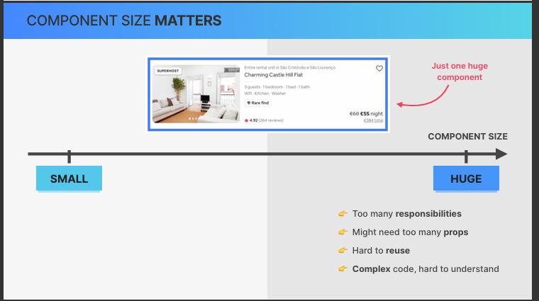

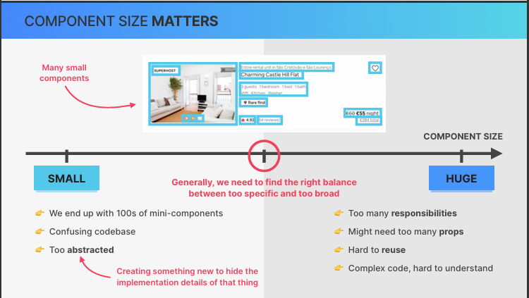

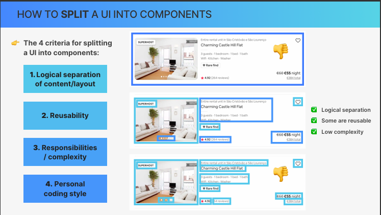

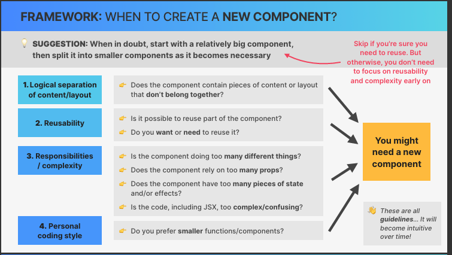

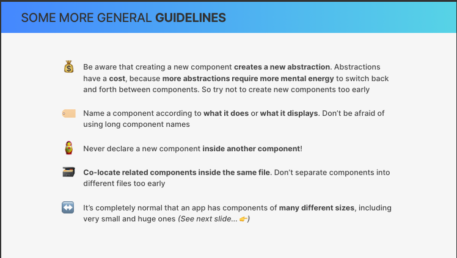

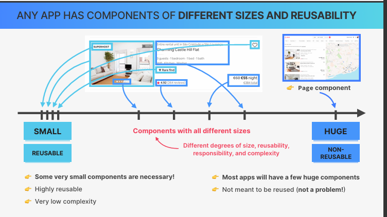

---

# 108. **Splitting Components in Practice**

---

```js
import { useState } from "react";

const tempMovieData = [
  {
    imdbID: "tt1375666",
    Title: "Inception",
    Year: "2010",
    Poster:
      "https://m.media-amazon.com/images/M/MV5BMjAxMzY3NjcxNF5BMl5BanBnXkFtZTcwNTI5OTM0Mw@@._V1_SX300.jpg",
  },
  {
    imdbID: "tt0133093",
    Title: "The Matrix",
    Year: "1999",
    Poster:
      "https://m.media-amazon.com/images/M/MV5BNzQzOTk3OTAtNDQ0Zi00ZTVkLWI0MTEtMDllZjNkYzNjNTc4L2ltYWdlXkEyXkFqcGdeQXVyNjU0OTQ0OTY@._V1_SX300.jpg",
  },
  {
    imdbID: "tt6751668",
    Title: "Parasite",
    Year: "2019",
    Poster:
      "https://m.media-amazon.com/images/M/MV5BYWZjMjk3ZTItODQ2ZC00NTY5LWE0ZDYtZTI3MjcwN2Q5NTVkXkEyXkFqcGdeQXVyODk4OTc3MTY@._V1_SX300.jpg",
  },
];

const tempWatchedData = [
  {
    imdbID: "tt1375666",
    Title: "Inception",
    Year: "2010",
    Poster:
      "https://m.media-amazon.com/images/M/MV5BMjAxMzY3NjcxNF5BMl5BanBnXkFtZTcwNTI5OTM0Mw@@._V1_SX300.jpg",
    runtime: 148,
    imdbRating: 8.8,
    userRating: 10,
  },
  {
    imdbID: "tt0088763",
    Title: "Back to the Future",
    Year: "1985",
    Poster:
      "https://m.media-amazon.com/images/M/MV5BZmU0M2Y1OGUtZjIxNi00ZjBkLTg1MjgtOWIyNThiZWIwYjRiXkEyXkFqcGdeQXVyMTQxNzMzNDI@._V1_SX300.jpg",
    runtime: 116,
    imdbRating: 8.5,
    userRating: 9,
  },
];

const average = (arr) =>
  arr.reduce((acc, cur, i, arr) => acc + cur / arr.length, 0);

export default function App() {
  return (
    <>
      <NavBar />
      <Main />
    </>
  );
}

function NavBar() {
  return (
    <>
      <nav className="nav-bar">
        <Logo />
        <Search />
        <NumResults />
      </nav>
    </>
  );
}

function Logo() {
  return (
    <div className="logo">
      <span role="img">🍿</span>
      <h1>usePopcorn</h1>
    </div>
  );
}

function Search() {
  const [query, setQuery] = useState("");
  return (
    <input
      className="search"
      type="text"
      placeholder="Search movies..."
      value={query}
      onChange={(e) => setQuery(e.target.value)}
    />
  );
}

function NumResults() {
  return (
    <p className="num-results">
      Found <strong>X</strong> results
    </p>
  );
}

function Main() {
  return (
    <main className="main">
      <ListBox />
      <WatchedBox />
    </main>
  );
}

function ListBox() {
  const [isOpen1, setIsOpen1] = useState(true);
  return (
    <div className="box">
      <button
        className="btn-toggle"
        onClick={() => setIsOpen1((open) => !open)}
      >
        {isOpen1 ? "–" : "+"}
      </button>
      {isOpen1 && <MovieList />}
    </div>
  );
}

function MovieList() {
  const [movies, setMovies] = useState(tempMovieData);

  return (
    <ul className="list">
      {movies?.map((movie) => (
        <Movie movie={movie} key={movie.imdbID} />
      ))}
    </ul>
  );
}

function Movie({ movie }) {
  return (
    <li>
      
      <h3>{movie.Title}</h3>
      <div>
        <p>
          <span>🗓</span>
          <span>{movie.Year}</span>
        </p>
      </div>
    </li>
  );
}

function WatchedBox() {
  const [isOpen2, setIsOpen2] = useState(true);
  const [watched, setWatched] = useState(tempWatchedData);

  return (
    <div className="box">
      <button
        className="btn-toggle"
        onClick={() => setIsOpen2((open) => !open)}
      >
        {isOpen2 ? "–" : "+"}
      </button>
      {isOpen2 && (
        <>
          <WatchedSummary watched={watched} />
          <WatchedMoviesList watched={watched} />
        </>
      )}
    </div>
  );
}

function WatchedSummary({ watched }) {
  const avgImdbRating = average(watched.map((movie) => movie.imdbRating));
  const avgUserRating = average(watched.map((movie) => movie.userRating));
  const avgRuntime = average(watched.map((movie) => movie.runtime));
  return (
    <div className="summary">
      <h2>Movies you watched</h2>
      <div>
        <p>
          <span>#️⃣</span>
          <span>{watched.length} movies</span>
        </p>
        <p>
          <span>⭐️</span>
          <span>{avgImdbRating}</span>
        </p>
        <p>
          <span>🌟</span>
          <span>{avgUserRating}</span>
        </p>
        <p>
          <span>⏳</span>
          <span>{avgRuntime} min</span>
        </p>
      </div>
    </div>
  );
}

function WatchedMoviesList({ watched }) {
  return (
    <ul className="list">
      {watched.map((movie) => (
        <WatchedMovie movie={movie} key={movie.imdbID} />
      ))}
    </ul>
  );
}

function WatchedMovie({ movie }) {
  return (
    <li>
      
      <h3>{movie.Title}</h3>
      <div>
        <p>
          <span>⭐️</span>
          <span>{movie.imdbRating}</span>
        </p>
        <p>
          <span>🌟</span>
          <span>{movie.userRating}</span>
        </p>
        <p>
          <span>⏳</span>
          <span>{movie.runtime} min</span>
        </p>
      </div>
    </li>
  );
}
```

---

# 109. **Component Categories**

---

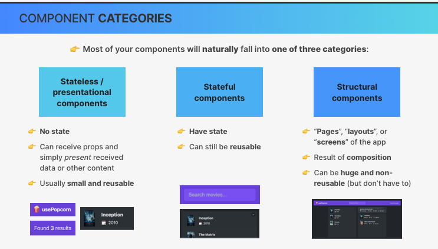

---

# 110. **Prop Drilling**

---

## 🧠 What is Prop Drilling?

Prop drilling happens when you pass data (via props) from a top-level component down to deeply nested child components — even if some components in between don’t need that data themselves. It’s like handing a note through several people just to reach the person who actually needs it.

## 🧱 Why Is Prop Drilling a Problem?

- Clutters components: Intermediate components must accept and pass along props they don’t use.

- Harder to manage: If many levels are involved, it becomes difficult to track and update data flow.

- Reduces reusability: Components become tightly coupled to specific data paths.

---

# 111. **Component Composition**

---

## 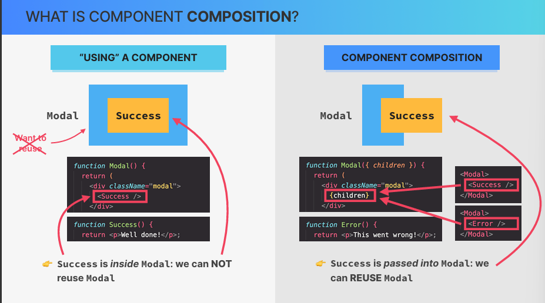

---

# 113. **Using Composition to Make a Reusable Box**

---

```js
<NavBar>
  <Search />
  <NumResults movies={movies} />
</NavBar>
```

```js
function NavBar({ children }) {
  return <nav className="nav-bar">{children}</nav>;
}
```

## ✅ NavBar no longer needs to "carry" props it doesn't use.

## 🧱 Why This Is Better

Makes components like NavBar, Main, or ListBox reusable.

Avoids cluttering intermediate components with unused props.

Keeps data closer to where it’s actually needed.

## 💡 Rule of Thumb

- Use this When?
  props When component needs specific data
  children When component wraps or structures UI
  context When data is needed in many places

## 🧰 Reusable Template (For Future)

```js
function Wrapper({ children }) {
  return <div className="wrapper">{children}</div>;
}

// Usage:
<Wrapper>
  <Content />
</Wrapper>;
```
